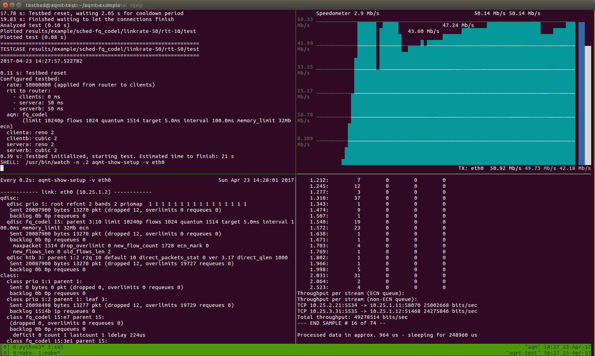
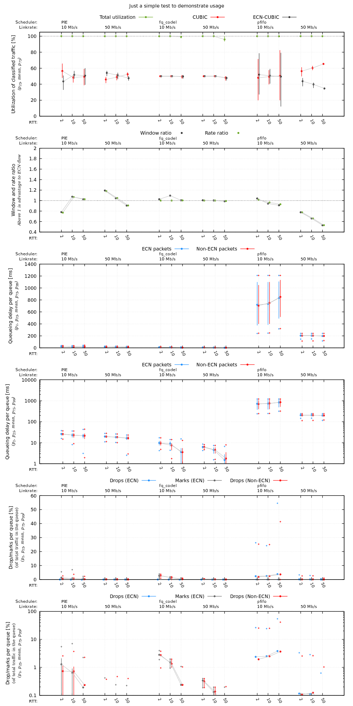
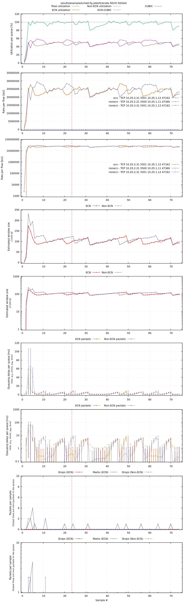

# Example usage of the AQM test framework

This demonstrates the use of https://github.com/henrist/aqmt

## Getting started using Docker

Make sure you fulfill all the dependencies listed at the aqmt repository.
The following description should normally be all you need.

This should work on a clean Ubuntu 17.04 install:

Follow https://docs.docker.com/engine/installation/linux/ubuntu/
to install Docker CE. On Ubuntu 17.04 you might need to change
the target distribution from zesty to yakkety for Docker in
`/etc/apt/sources.list`, because official zesty support will
become stable in June 2017.

Follow https://docs.docker.com/compose/install/ to install `docker-compose`.

Follow https://docs.docker.com/engine/installation/linux/linux-postinstall/
to be able to use Docker without sudo. (Note that this is similar to having
full sudo access all time for that user.)

```bash
sudo apt install \
  g++ \
  libpcap-dev \
  make

git clone https://github.com/henrist/aqmt-example.git
cd aqmt-example
```

### Cloning dependency repos and building dependencies

The `Makefile` will clone the required repositories, build and load
the schedulers, and build other dependencies inside the aqmt project.

```bash
make
```

As we are going to use Docker, also run:

```bash
make aqmt_docker
```

This might take some time, as it will build the Docker image including our
needed packages, compile iproute2, and add other utilities.

### Run Docker containers and connect to AQM container

Start the Docker containers in a seperate terminal:

```bash
make start_docker
```

If everything goes well, you will now have 6 running Docker containers.
Go back to your first terminal.

SSH into the AQM container:

```bash
make ssh_aqm
```

You are now inside the Docker container! The `aqmt-example` repository you
have cloned, is now available in `/opt/testbed`, and you should be at that
directory. Note that files you add outside of these directories will not
be visible to you outside Docker!

The `aqmt` repository is available in `/opt/aqmt`, and you should have access
to all the programs and variables we are using.

You can try this by:

```bash
echo $IP_CLIENTA
aqmt-show-setup
```

### Running a test

While you are connected with SSH to the AQM container, start tmux, which
is a terminal multiplexer allowing us to have multiple terminals:

```bash
tmux
```

You can now run the example test. For fun, we run it interactivly so we
can look what is going on. This is why we need tmux.

```bash
TEST_INTERACTIVE=1 ./example.py
```

Accept to start the test.

When the test is finished, you can have a look inside `results/example`
directory which will contain all the test data, as well as plottings
from the test!

Now feel free to edit the example and design your own tests.

Here is an image showing you a test in progress:



Graph comparing the tests:



And to be able to get an understanding of what happened during a test,
all tests generate a flow plot. Here is the one for fq_codel with
50 Mbps and 50 ms base RTT:


